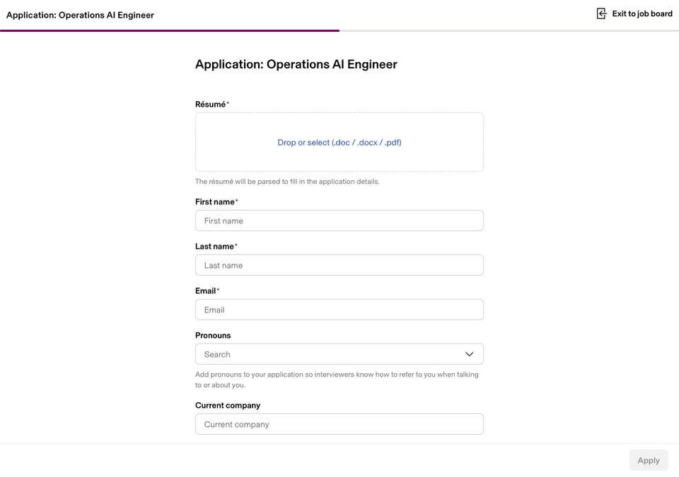

# I Applied to Opendoor Using Only AI

When Opendoor's CEO challenged applicants to apply to the Operations AI Engineer role
using **only AI** for a chance to skip to the final round, I took it literally.

This repo contains the agent that did it — and the proof that it worked.

## The Recording



## What This Agent Does

```
Resume PDF ──→ Parse ──→ Structured Data ──→ Cover Letter (Claude API)
                                                    │
                                                    ▼
GitHub Repo ←── Push ←── GIF ←── Screenshots ←── Form Fill (Playwright + Claude Vision)
     │                                                │
     └── README (this file) ──────────────────────────┘
```

1. **Parses** my resume PDF and extracts structured data
2. **Creates** this GitHub repo (solving the chicken-and-egg: the cover letter links here)
3. **Generates** a tailored, self-referential cover letter using Claude's API
4. **Opens** the ATS form in a real browser
5. **Uses Claude's vision API** to dynamically discover and fill every field
6. **Uploads** my resume and the AI-generated cover letter
7. **Records** the entire process as a GIF
8. **Pushes** everything to this repo

## Tech Stack

| Component | Tool | Purpose |
|-----------|------|---------|
| Brain | Claude API (Sonnet) | Vision-based form analysis + cover letter generation |
| Hands | Playwright | Browser automation |
| Eyes | Screenshots → Claude Vision | Dynamic form field discovery |
| Memory | PyMuPDF | Resume PDF parsing |
| Pen | fpdf2 | Cover letter PDF rendering |
| Camera | Pillow + imageio | GIF recording |

## The Cover Letter

The cover letter references this repo. This repo contains the cover letter.
The snake eats its own tail.

📄 [Read the cover letter](output/cover_letter.pdf)

## How to Run It Yourself

```bash
git clone https://github.com/MauryRubin/opendoor-ai-application
cd opendoor-ai-application
python -m venv venv && source venv/bin/activate
pip install -r requirements.txt
playwright install chromium

# Set your API keys
cp .env.example .env
# Edit .env with your ANTHROPIC_API_KEY and GITHUB_TOKEN

# Add your personal details (gitignored)
cp applicant.example.json applicant.json
# Edit applicant.json with your name, email, phone, etc.

# Edit job.json to point at the role you are applying to.

# Dry run (fills form without submitting)
python apply.py --dry-run

# Real run
python apply.py
```

## Cost

Total Claude API cost for this application: **$0.01**

| Call | Tokens In | Tokens Out | Cost |
|------|-----------|------------|------|
| cover_letter_generation | 2,141 | 508 | $0.0140 |

## Why This Matters

This isn't just a job application — it's a working prototype of the kind of AI-powered
operational workflow I'd build at Opendoor every day.

It handles **ambiguity** (unknown form fields discovered via vision), integrates **multiple APIs**
(Claude, GitHub, Playwright), produces **auditable output** (screenshots, logs, cost tracking),
and runs **end-to-end without human intervention**.

That's the job description. This is the proof.

## Submitted

🕐 2026-05-14 00:10 UTC

---

Built with Claude API, Playwright, and a healthy appreciation for meta-humor.
